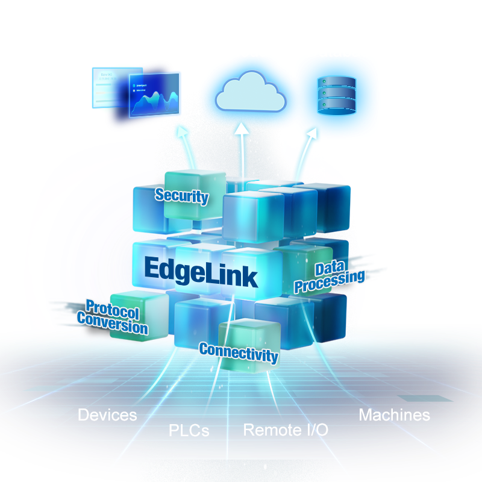
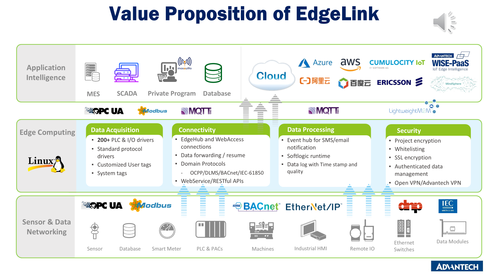
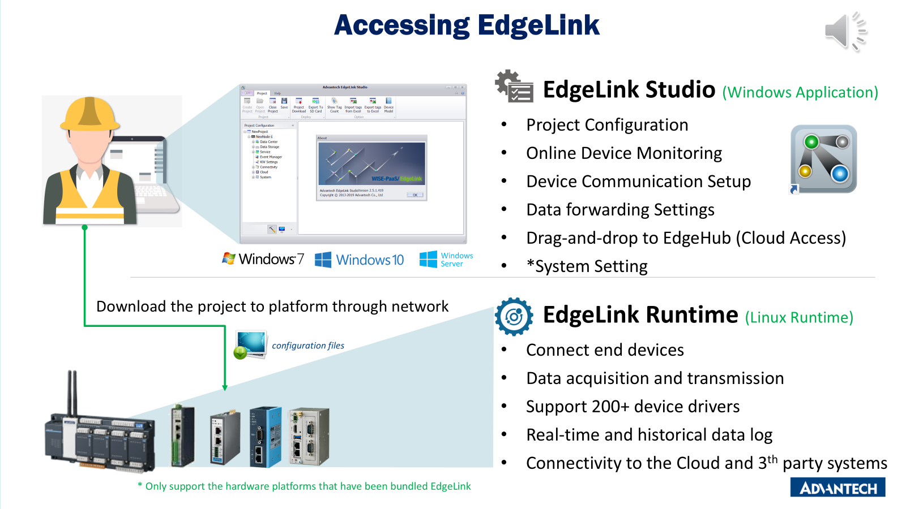

## 0. Suggest a container name on Container Catalog

edgelink



## 1. Container Functional Overview

EdgeLink facilitates protocol conversion and secure connections. it seamlessly connects over 200 types of OT devices with the cloud, ensuring a robust link between them.

## 2. Container Key Features

The core values of EdgeLink are reflected in the following four aspects:

First, **Connectivity**: EdgeLink ensures robust and reliable connections between edge devices and the cloud, enabling seamless data transmission and communication.

Second, **Data Processing**: It provides efficient data processing capabilities, allowing for real-time analysis and decision-making at the edge, reducing latency and enhancing operational responsiveness.

Second,**Protocol Conversion**: EdgeLink supports the translation of various industrial protocols, enabling interoperability between different devices and systems, which is crucial for integrating legacy systems with modern technologies.

Lastly, **Security**: It offers advanced security features to protect data integrity and privacy, ensuring that edge devices and the data they handle are secure from potential threats and vulnerabilities.

## 3. Supported Host Device List

arm or x86 CPU with Ubuntu OS

## 4. Prerequisite software 

### installed on Windows

EdgeLink Studio (Windows app): is a gateway configuration tool for off-line communication and network interface configuration. It supports one-click downloads to the gateways and supports online device status management and monitoring. 

[EdgeLink Studio](https://www.advantech.com.cn/zh-cn/support/details/utility?id=1-28QPAEB)

### System Requirements Host OS

- Docker and Docker Compose
- Linux-based operating system (Ubuntu 20.04+ recommended)

## 5. Quick Start

1. Clone the repository to your local machine

```bash
# Clone the repository
git clone https://github.com/Advantech-EdgeSync-Containers/Edgelink-docker.git
cd Edgelink-docker
```

2. Run the build script to detect and install Agent:

```bash
chmod +x build.sh
sudo ./build.sh
```
3. Start Edgleink Studio to download your project.

## 6. Software Components on Container Image



## 7. Quick Start Guide



[Quick Start](https://www.advantech.com.cn/zh-cn/support/details/manual?id=1-28LPZU5)

## 8. Best Practice / Known Limitations

## 9. Performance Benchmarking (if any)
